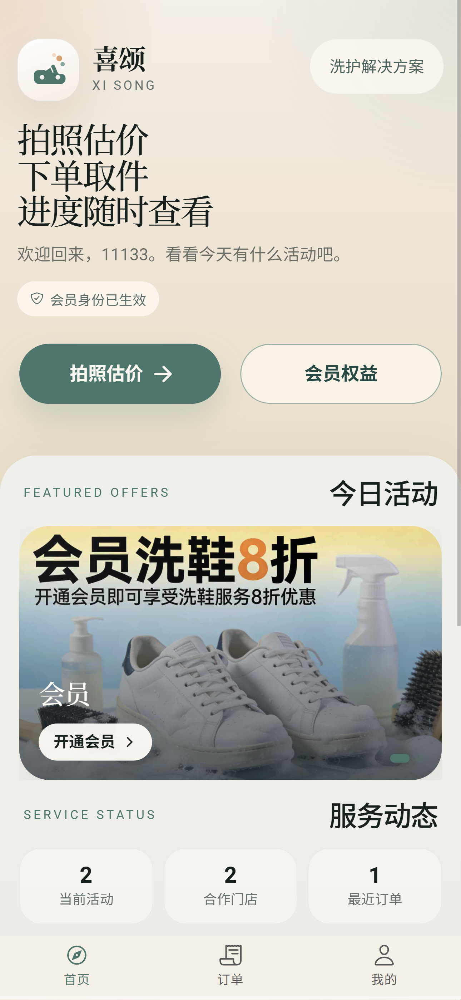

# Wash Web

一个面向洗鞋/洗护场景的 Web 应用，覆盖从「拍照识别鞋况、智能推荐洗护方案、选择优惠并支付」到「管理员更新订单进度、用户查看订单时间线与阶段图片」的完整演示流程。

项目采用前后端同仓结构：前端使用 React + Ionic + Vite，后端使用 Express + TSX，本地通过 JSON 文件保存订单、用户、门店、折扣与管理员配置。

## 效果截图

<p align="center">
  
</p>

## 项目特点

- 用户端支持注册、登录、资料维护、密码修改与会员升级
- 支持保存多套下单资料，可设置默认资料，下单时可切换联系人和地址
- 下单流程支持三张鞋图上传、图片压缩、AI 鞋况识别、重拍提示和识别结果人工修正
- 内置洗护定价规则，可根据鞋型、材质、污损、品牌和物流距离生成基础费用
- 根据用户偏好、门店能力、材质匹配和污损类型生成推荐方案与备选方案
- 支持普通折扣、首单优惠、折扣图片和首页活动轮播
- 支持模拟扫码支付，支付后自动写入服务端订单并追加订单进度
- 订单中心支持本地订单与服务端订单查询、状态筛选、订单详情页和阶段图片查看
- 订单生命周期已扩展为：待支付、已支付、进一步确价、送到洗鞋店、清洗中、清洗完成、送回中、已送达、已取消
- 管理后台支持订单查看、订单图片预览、进度更新、阶段说明、阶段图片上传、门店管理和折扣管理
- 服务端会将下单图片与阶段图片落盘到 `public/uploads/orders`
- 数据默认保存在本地 `data/*.json`，适合演示、原型和本地部署

## 主要功能

### 用户端

- 启动页、首页、会员页、订单页、账户页和下单流程已打通
- 首页展示品牌信息、活动轮播和快捷下单入口
- 注册/登录用户账号，维护账户资料并修改密码
- 管理多套订单资料，包括资料名称、姓名、电话、取件地址和备注
- 进入拍照估价流程，按引导上传鞋面、侧面、鞋底等图片
- 调用 `/api/analyze-shoe` 识别鞋型、品牌、材质、焕新分和可见污损
- 对识别结果进行人工修正后生成推荐洗护方案
- 按偏好选择均衡、性价比、品质、速度或去氧化类服务方向
- 查看价格明细，包括基础费、污损费、服务费、附加项、优惠和最终金额
- 选择折扣或首单优惠并进入模拟支付
- 支付完成后查看订单成功页，并在订单中心追踪状态
- 进入订单详情页查看订单金额、联系人、门店、预计耗时和进度时间线
- 点击带图片的进度节点查看阶段图片

### 管理端

- 首次进入可初始化管理员密码，之后使用管理员密码登录
- 查看全部订单、订单金额、鞋款信息、联系人和地址
- 预览用户下单时上传的鞋图
- 按订单追加进度记录，支持选择阶段状态、填写阶段说明和上传最多 4 张阶段图片
- 删除订单时同步清理对应的上传图片
- 新增、编辑、删除门店
- 新增、编辑、删除折扣活动
- 折扣支持标题、说明、折扣百分比、图片地址、适用人群和普通/首单模式

## AI 识别与定价说明

- 鞋况识别通过 `src/services/qwen.ts` 调用 DashScope 兼容 OpenAI 接口，默认模型为 `Qwen3.6-Plus`
- 需要在 `.env` 中配置 `DASHSCOPE_API_KEY`，可选配置 `DASHSCOPE_VISION_MODEL`
- AI 只负责输出鞋型、品牌、材质、焕新分和污损描述，不直接返回价格
- 如果图片无法识别为清晰鞋子，接口会返回重拍提示
- 费用由 `src/services/pricing.ts` 的本地规则计算，最终价格仍按演示逻辑处理
- 支付流程为模拟支付，仅提供“我已完成支付”的演示状态流转

示例 `.env`：

```bash
DASHSCOPE_API_KEY=your_api_key_here
DASHSCOPE_VISION_MODEL=Qwen3.6-Plus
```

## 技术栈

- 前端：React 19、Ionic React、React Router 5、Vite、TypeScript
- 后端：Express、TSX
- AI 接口：OpenAI SDK 兼容 DashScope
- 动效与图标：motion、Ionicons、lucide-react
- 样式：自定义 CSS
- 数据存储：本地 JSON 文件

## 目录结构

```text
.
├─ src/                 前端源码、业务模型、接口封装与服务逻辑
├─ docs/                README 截图等文档资源
├─ public/              静态资源与上传目录
├─ data/                本地数据文件
├─ dist/                构建产物
├─ server.ts            Express + Vite 开发服务器与 API
├─ package.json
└─ README.md
```

## 运行环境

- Node.js 18 及以上
- npm 9 及以上

## 安装依赖

```bash
npm install
```

## 本地开发

```bash
npm run dev
```

启动后访问：

```text
http://localhost:3000
```

开发模式下，`server.ts` 会启动 Express，并以内嵌 Vite 中间件的方式提供前端页面与接口服务。

## 构建与检查

```bash
npm run build
npm run lint
```

`npm run build` 会将前端构建到 `dist/`。`npm run lint` 当前执行 `tsc --noEmit`。

## 默认数据文件

服务启动时会自动检查并初始化以下文件：

- `data/orders.json`：订单数据
- `data/shops.json`：门店数据
- `data/admin_config.json`：管理员配置
- `data/users.json`：用户数据
- `data/discounts.json`：折扣数据

首次启动时，系统会自动写入 3 个示例门店，并带有距离、评分、擅长材质和特色服务等推荐字段。

## 主要页面

- `/`：启动页
- `/app/home`：首页
- `/app/order`：拍照识别与下单流程
- `/app/order/result`：推荐方案与价格结果
- `/app/order/info`：下单资料确认
- `/app/order/pay`：模拟支付
- `/app/orders`：订单中心
- `/app/orders/:orderId`：订单详情
- `/app/orders/:orderId/progress/:progressId`：订单阶段图片查看
- `/app/account`：账户与订单资料管理
- `/admin`：管理后台

## 主要接口

### 管理员

- `POST /api/admin/setup`：初始化管理员密码
- `POST /api/admin/login`：管理员登录
- `GET /api/admin/status`：查询管理员是否已初始化
- `GET /api/admin/verify`：校验管理员 token

### AI 识别

- `POST /api/analyze-shoe`：识别鞋图并返回鞋况数据

### 订单

- `GET /api/orders`：获取全部订单，需要管理员 token
- `POST /api/orders`：创建订单
- `GET /api/orders/:id`：获取单个订单
- `PUT /api/orders/:id/status`：修改订单状态，需要管理员 token
- `PUT /api/orders/:id/progress`：追加订单进度、阶段说明和阶段图片，需要管理员 token
- `POST /api/orders/:id/pay`：标记订单为已支付并追加支付进度
- `DELETE /api/orders/:id`：删除订单并清理订单图片

### 门店

- `GET /api/shops`：获取门店列表
- `POST /api/shops`：创建门店，需要管理员 token
- `PUT /api/shops/:id`：更新门店，需要管理员 token
- `DELETE /api/shops/:id`：删除门店，需要管理员 token

### 用户

- `POST /api/users/register`：注册
- `POST /api/users/login`：登录
- `GET /api/users/:id`：获取用户资料
- `PUT /api/users/:id/defaultInfo`：更新默认订单资料
- `PUT /api/users/:id/orderInfos`：更新多套订单资料与默认资料
- `PUT /api/users/:id/password`：修改密码
- `POST /api/users/:id/upgrade`：升级为 VIP

### 折扣

- `GET /api/discounts`：获取折扣列表
- `POST /api/discounts`：创建折扣，需要管理员 token
- `PUT /api/discounts/:id`：更新折扣，需要管理员 token
- `DELETE /api/discounts/:id`：删除折扣，需要管理员 token

## 上传与静态资源

- 订单提交时，如果图片是 base64 数据，服务端会自动转存到 `public/uploads/orders`
- 管理员上传阶段图片时，也会转存到 `public/uploads/orders`
- 图片最终通过 `/uploads/orders/*` 路径对外访问
- 删除订单时会尝试删除订单主图和阶段图片
- 生产模式下会托管 `dist/` 和 `public/uploads` 下的内容

## 已知限制

- 暂未接入数据库，重度并发与多实例部署不适合使用当前 JSON 存储方案
- 暂未接入真实支付，仅提供演示支付流程
- AI 识别依赖 DashScope API Key，未配置密钥时无法完成识别
- AI 识别和规则定价仍是演示级方案，最终洗护价格需要人工复核
- 管理员鉴权目前是演示实现，登录成功后返回固定 `demo-token`
- 用户密码与管理员密码目前以明文形式保存在本地 JSON 文件中，仅适合开发或演示环境

## 后续可优化方向

- 将订单、用户、门店、折扣迁移到数据库
- 为管理员与用户接入真正的鉴权体系
- 密码改为加盐哈希存储
- 接入真实支付平台和支付回调
- 为 AI 识别增加多图综合分析与人工复核后台
- 为订单进度图片增加多图浏览、删除和重新上传能力
- 为服务端与前端补齐测试
